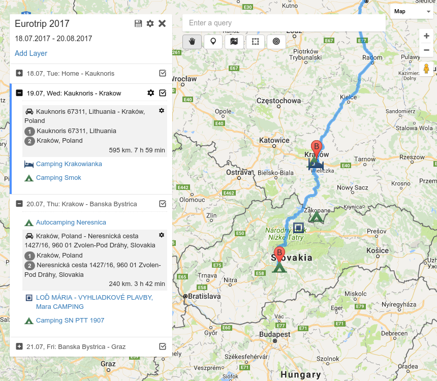

# route-planner-vue

Simple hello-world-vue rebuild of my old [route planner](https://github.com/Kasheftin/RoutePlanner). It was written to deeply understand vue.js and vuex.

## The Demo

See [the demo on github pages](https://kasheftin.github.io/route-planner-vue/) or [standalone version on my server](https://route-planner.booger.ru/).

Here's the sample of my [eurotrip 2017](https://kasheftin.github.io/route-planner-vue/#id=35edf9f9873e1f00001e934f).



## Core functionality

* Unlimited markers, polygons and direction paths on the map, organized into unlimited sortable layers.
* The possibility to mark POI (places of interests), add them to the layer like any other usual marker and comment.
* Up to 20 waypoints for each route, draggable directions.
* Export to simple JSON object and import JSON as well alongside with storing data serverside.
* Private keys allow to share project for collaborate work, read only sharing also supported.

## Libraries

 * [vue.js](https://vuejs.org/) with a lot of [velocity](https://github.com/julianshapiro/velocity) animations.
 * [vuex](https://vuex.vuejs.org/) with namespaced modules, normalizr approach and flat structure.
 * [vue2-google-maps](https://github.com/xkjyeah/vue-google-maps) + native google maps api for directions.
 * [sortablejs](https://github.com/RubaXa/Sortable) with [vuedraggable](https://github.com/SortableJS/Vue.Draggable).
 * Centralized event bus like [this one](https://jsfiddle.net/g8Lqv0rx/10/).
 * Centralized [promise bus](https://github.com/Kasheftin/route-planner-vue/blob/master/src/utils/PromisesBus.js).
 * [Fontello](http://fontello.com/) because there is no webpack's icon generator I could operate with.
 * [Bootstrap3 sass](https://github.com/twbs/bootstrap-sass).

## Build Setup

``` bash
# install dependencies
npm install

# serve with hot reload at localhost:8080
npm run dev

# build for production with minification
npm run build
```

For detailed explanation on how things work, consult the [docs for vue-loader](http://vuejs.github.io/vue-loader).
